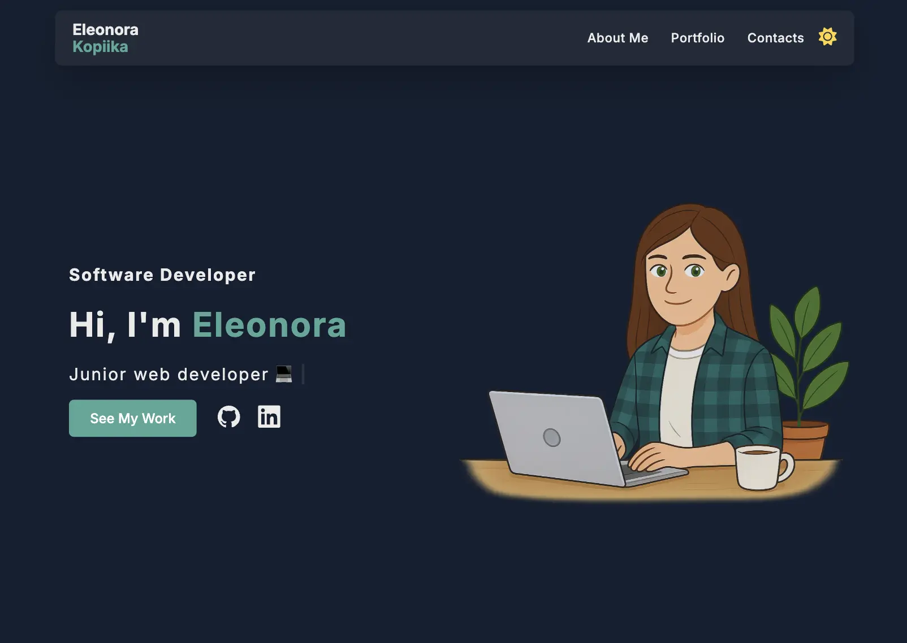
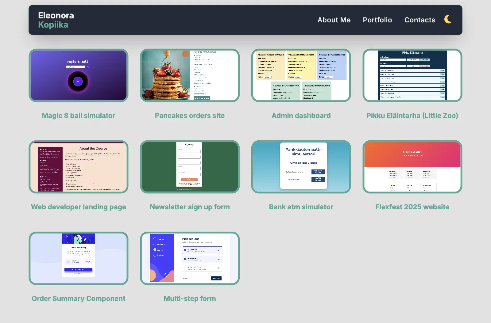

# Frontend Portfolio

A clean and minimalist frontend portfolio built with **HTML**, **CSS**, and **Vanilla JavaScript**.  
This project highlights my front-end development skills through real-world examples and responsive layouts.

---

## ✨ Features

- **Responsive Design** – works seamlessly on desktop, tablet, and mobile devices  
- **Modern UI/UX** – clean, minimalist layout with smooth scrolling and animations  
- **Interactive Elements** – modal windows, back-to-top button, theme toggle  
- **Projects Showcase** – CSS Grid gallery with project details  
- **Lightweight Tech Stack** – built with HTML, CSS, and vanilla JavaScript  

---

## 🛠️ Technologies Used


---

## 📸 Preview

Screenshots of the current layout (homepage and projects page):

  
  

---

## 🚀 Live Demo

Check out the live version of the portfolio hosted on GitHub Pages:

👉 [frontend-portfolio](https://kopiika.github.io/frontend-portfolio/)

---

## 📂 Projects Included

Here are some of the projects showcased in this portfolio:  

- 🎨 [Landing Page](https://kopiika.github.io/landing-page/)  
  *HTML, CSS* – Responsive landing page with a modern layout and smooth animations.  

- 🎬 [Movie App](https://kopiika.github.io/movie-app/)  
  *HTML, CSS, JS (API)* – A movie search app using the OMDb API with dynamic results rendering.  

- 🛒 [Mini E-Commerce](https://kopiika.github.io/ecommerce-app/)  
  *HTML, CSS, JS (localStorage)* – A simple e-commerce demo with shopping cart functionality.  

- 📊 [Dashboard UI](https://kopiika.github.io/dashboard-ui/)  
  *HTML, CSS, JS* – A responsive dashboard interface with charts and widgets.  

---

## 📂 Project Structure
```bash
├── index.html # Homepage with last projects section
├── projects.html # Page listing full project portfolio
├── style.css # Main stylesheet for layout and themes
├── reset.css # CSS reset to normalize browsers
├── script.js # JavaScript for interactivity
└── image/ # Folder containing screenshots and assets
```
---

## 🤝 How to Contribute

1. Fork the project  
2. Create a feature branch: `git checkout -b feature/my-new-feature`  
3. Commit your changes: `git commit -am 'Add some feature'`  
4. Push to the branch: `git push origin feature/my-new-feature`  
5. Open a Pull Request – I’ll review and provide feedback!  

---

## 📞 Contact

Feel free to reach out:

- GitHub: [@Kopiika](https://github.com/Kopiika)  
- LinkedIn: [Eleonora Kopiika](https://www.linkedin.com/in/eleonora-kopiika/)    

---

⭐️ *Thanks for visiting my portfolio repository!*
