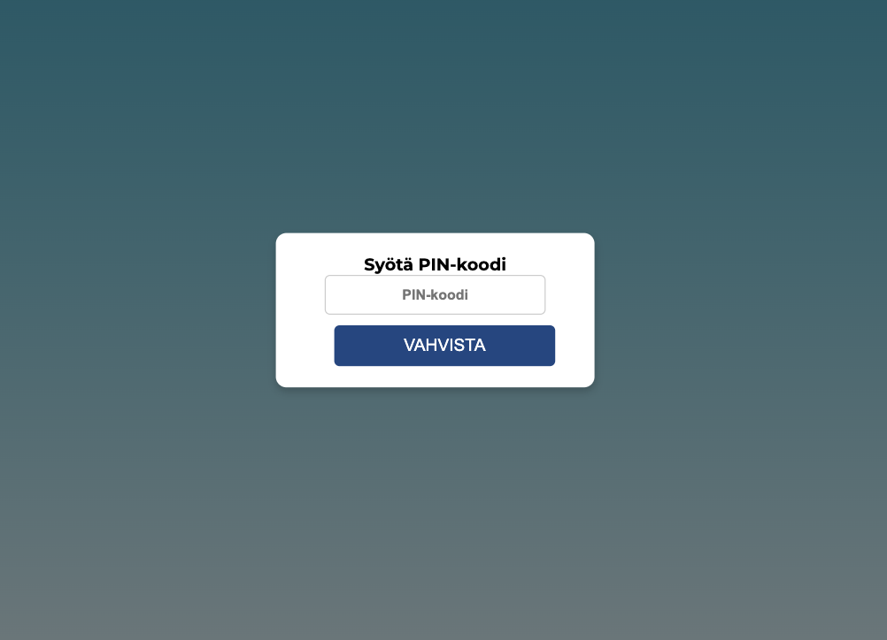

# 🏦 Bank ATM Simulator

A simple **ATM (bank machine) simulator** built with **HTML, CSS, and JavaScript**.  
The app allows users to log in with a PIN code, check their balance, deposit money, and withdraw money through a clean and responsive web interface.  

This project was created as part of a programming assignment to practice **DOM manipulation, event handling, and input validation**.

---

## 📸 Preview




---

## ✨ Features

- 🔑 **PIN login** – Users must enter the correct PIN (1234) to access the ATM  
- 💰 **Balance check** – Current balance is displayed and updated live  
- ➕ **Deposit money** – Enter an amount and add it to the balance  
- ➖ **Withdraw money** – Enter an amount to withdraw (only if balance is sufficient)  
- ⚠️ **Error handling** – Prevents invalid input (negative or empty values) and shows error messages  
- 🎨 **Responsive design** – Styled with CSS (gradient background, Google Fonts, hover effects)  

---

## 🛠️ Tech Stack

- **HTML5** – Structure of the app  
- **CSS3** – Styling and layout (responsive, modern design)  
- **JavaScript (Vanilla)** – Logic for authentication, deposits, withdrawals, and error handling  

---

## 📂 Project Structure
```bash
├── index.html # Main HTML structure
├── style.css # Custom styles
└── script.js # JavaScript logic
├── image/    # Page screenshots 
└── README.md # Project documentation
```
---

## 🚀 How to Run

1. Download or clone this repository  
2. Open `index.html` in your browser  
3. Enter the PIN code (`1234`) to log in  
4. Start using the ATM:  
   - Deposit money  
   - Withdraw money  
   - Check balance updates instantly  

---
## ⚖️ License

Created by [Eleonora Kopiika](https://www.linkedin.com/in/eleonora-kopiika/)
This project was created for **educational purposes**.  