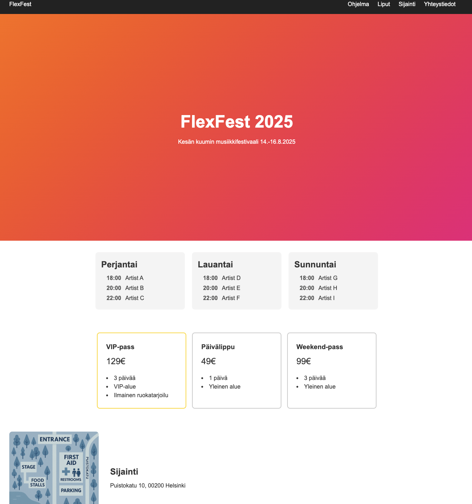
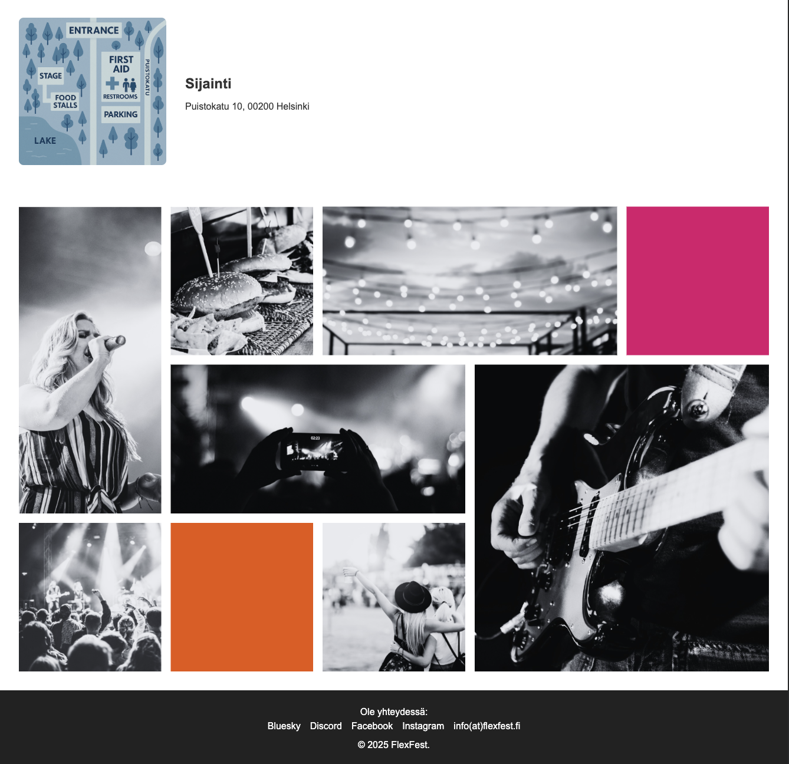

# FlexFest 2025 Website  

This is a **practice project** for creating a festival landing page using **Flexbox** and **CSS Grid**.  
The project focuses on building a responsive layout for desktop (and optional mobile) views without JavaScript.  

---

## 🎵 Project Overview  

The page represents **FlexFest 2025**, a fictional summer music festival in Helsinki.  
It includes the following sections:  

- **Header & Navigation** – Festival logo and menu links  
- **Hero Section** – Main festival title and dates  
- **Program Calendar** – Schedule of artists for each day  
- **Ticket Cards** – Ticket types and pricing  
- **Location Section** – Map and festival address  
- **Gallery Section** – Image gallery using CSS Grid  
- **Footer** – Contact and social links  

---
## 📸 Preview  

 


---

## ✨ Features  

- **Flexbox Layouts** for:  
  - Header navigation  
  - Program calendar  
  - Ticket cards  
  - Location section  
- **CSS Grid** for the **image gallery**  
- Responsive design for smaller screens (optional mobile view)  
- Modern styling with colors, spacing, and typography  

---

## 🛠️ Tech Stack  

- HTML5 – Semantic markup  
- CSS3 – Flexbox and Grid layout  
- Images – Festival map and gallery assets  

---

## 📂 Project Structure 
```bash
├── index.html # Main page markup
├── style.css # Styling for layout, Flexbox, and Grid
└── image/ # Map and gallery images
└── README.md # Project documentation
```	
---

## 🚀 How to Run  

1. Clone or download the repository  
2. Open `index.html` in a modern web browser  
3. Resize browser to test responsive layout and Flexbox/Grid behavior  

---

## ✅ Assignment Goals Covered  

- Practiced **Flexbox** for layout structure  
- Implemented **CSS Grid** for gallery  
- Created a visually organized, responsive festival webpage  
- No JavaScript is required; the focus is on CSS  

---

## ⚖️ License  

Created by [Eleonora Kopiika](https://www.linkedin.com/in/eleonora-kopiika/)
This project was created for **educational purposes**.  
All images used are either placeholders or from free sources.
