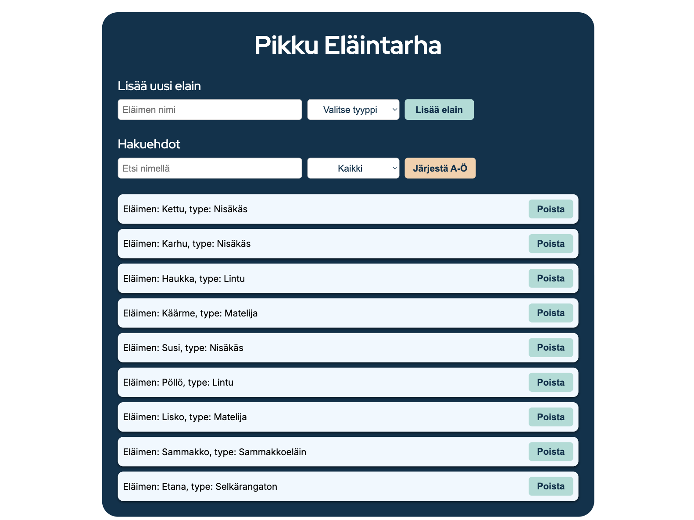

# Pikku Eläintarha (Little Zoo) 🦊🐻🦅  

This is a small project where we practice **arrays, objects, loops, conditions, functions, and DOM manipulation** by building a mini animal tracking app.  

It’s written in **HTML, CSS, and JavaScript** and shows how to create an interactive webpage where you can manage a list of animals.  

---

---


## ✨ Features

- 📋 **Display animals** – Animals are shown on the page from a predefined array  
- ➕ **Add animals** – Add new animals with a name and type  
- ❌ **Delete animals** – Each animal has a "Remove" button  
- 🔍 **Search by name** – Find animals dynamically while typing  
- 🐾 **Filter by type** – Show only mammals, birds, reptiles, etc.  
- 🔤 **Sort alphabetically** – Toggle between A–Z and Z–A sorting  
- 🎨 **Responsive UI** – Styled with CSS for both desktop and mobile   

---

## 🛠️ Tech used  

- **HTML5** → page structure  
- **CSS3** → styling and responsive layout  
- **JavaScript (vanilla)** → interactivity (add, filter, search, delete, sort)  

---

## 📂 Project files  
```bash
├── index.html # main page
├── style.css # styles
├── script.js # JavaScript logic
├── image/
│   └── favicon.png # little icon
│	 └── screenshot.png  # Page screenshot
└── README.md # Project documentation
```

---

## 🚀 How to run it  

1. Download or clone this repo  
2. Open `index.html` in your browser  
3. Try adding, searching, filtering, and removing animals! 🐾 

---

## ⚖️ License  

Created by [Eleonora Kopiika](https://www.linkedin.com/in/eleonora-kopiika/)
For educational purposes only.  