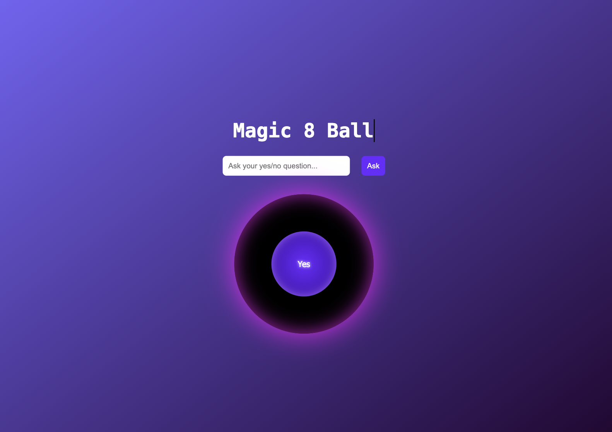

# 🎱 Magic 8 Ball Simulator  

An interactive **Magic 8 Ball** web app inspired by the classic pop-culture toy.  
Users can type a **yes/no question**, click **Ask**, and the ball will respond with a randomized answer.  

This project was created as part of an assignment to practice **HTML, CSS, and JavaScript**, with a focus on **CSS animations** and DOM manipulation.  

---
## 📸 Preview



---

## ✨ Features  

- Input field to type a **yes/no question**  
- Animated **Magic 8 Ball** that shakes when a question is asked  
- Randomized answers from a predefined list  
- Smooth **fade-in effect** for displaying the answer  
- Responsive design with a gradient background and styled input/button  

---

## 🛠️ Tech Stack  

- **HTML5** – Structure of the app  
- **CSS3** – Styling and animations (shake + fade-in)  
- **JavaScript (Vanilla)** – Random answer logic and interactivity  

---

## 📂 Project Structure  
```bash
├── index.html # Main HTML structure
├── styles.css # Styling and animations
└── script.js # Logic for random answers & events
├── image/
│   └── screenshot.png # Page screenshot
└── README.md # Project documentation
```

---

## 🚀 How to Use  

1. Open `index.html` in your browser  
2. Type a **yes/no style question** in the input field  
3. Click **Ask** (or press Enter)  
4. Watch the ball shake and reveal an answer 🎱  

---

## ✅ Assignment Goals Covered  

- Built a fully functional **Magic 8 Ball simulator**  
- Designed the ball and its **visual effects with CSS**  
- Implemented **@keyframes animations** (shake & fade-in)  
- Added **JavaScript logic** for random answers and event handling  
- Practiced using **AI tools for CSS design ideas**  

---

## ⚖️ License  

Created by [Eleonora Kopiika](https://www.linkedin.com/in/eleonora-kopiika/)
This project was created for **educational purposes**.  
All rights to the original *Magic 8 Ball* toy belong to **Mattel**. 