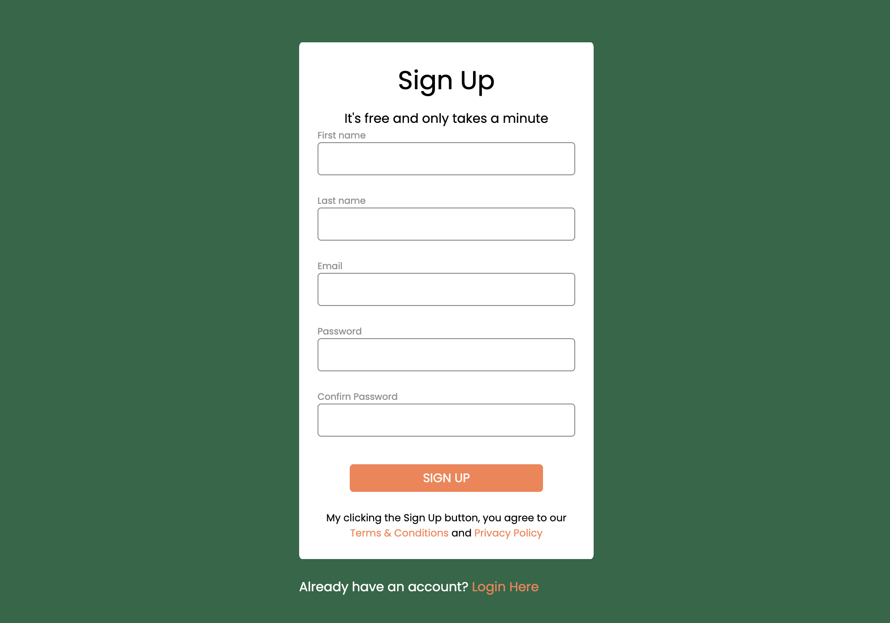

# Newsletter Sign-Up Form  

A simple, responsive **sign-up form** project built with **HTML, CSS, and JavaScript**.  
This project was created as part of an assignment to practice **form design, styling, and client-side validation**.  

---
## 📸 Preview  



---

## ✨ Features  

- Clean and modern **sign-up form layout**  
- Input fields for:  
  - First name  
  - Last name  
  - Email  
  - Password & Confirm Password  
- Styled **Sign Up button** with hover and active states  
- **Validation logic**:  
  - Prevents empty fields  
  - Ensures passwords match  
  - Displays error messages that disappear automatically after 3 seconds  

---

## 🛠️ Tech Stack  

- **HTML5** – for form structure  
- **CSS3** – for styling and responsive layout  
- **JavaScript (Vanilla)** – for client-side validation  

---

## 📂 Project Structure
```bash
├── index.html # Form markup
├── style.css # Stylesheet
└── script.js # Validation logic
└── README.md # Project documentation
```
---

## 🚀 How to Run  

1. Clone or download this repository  
2. Open `index.html` in your browser  
3. Fill in the form and test validation  

---

## ✅ Assignment Requirements Covered  

- Created a **newsletter subscription form**  
- Styled using **CSS** with colors, spacing, and hover effects  
- Used **Google Fonts (Poppins)** for clean typography  
- Implemented **validation logic** with JavaScript  

---

## ⚖️ License  

Created by [Eleonora Kopiika](https://www.linkedin.com/in/eleonora-kopiika/)
This project was created for **educational purposes**. 